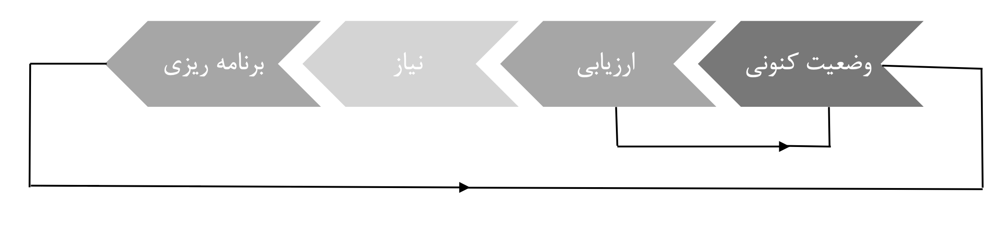

# Electrical Energy Analysis: Generation Expansion Planning (GEP)

## Project Overview
This project addresses the critical challenge of long-term power system planning over a 20-year horizon. As power grids face increasing demand and the transition toward sustainable energy, developing an optimal generation expansion strategy is essential for ensuring grid stability, economic efficiency, and environmental compliance.

## Project Scope
The analysis evaluates five key electricity generation technologies:
- **Natural Gas**
- **Coal**
- **Nuclear**
- **Solar (Photovoltaic)**
- **Wind**

The study aims to determine the optimal energy mix by comparing these technologies based on capital costs, operational characteristics, and environmental impacts (e.g., carbon tax policies). The methodology follows a structured iterative process: **Current Status Assessment → Needs Analysis → Planning & Optimization.**

## Key Objectives
- **Strategic Planning:** Determining the most cost-effective generation mix to meet future load growth.
- **Economic & Technical Evaluation:** Analyzing the viability of different generation assets under various economic constraints.
- **Policy Impact Assessment:** Evaluating how environmental regulations, such as carbon pricing, influence technology adoption.
- **Optimization:** Minimizing total system costs while maintaining reliability and capacity requirements.

## Repository Structure
- `/Data`: Input datasets including technology costs, capacity factors, and load forecasts.
- `/Analysis`: Scripts and models used for planning and optimization.
- `/Report`: The comprehensive project report detailing the planning methodology and final recommendations.

## Planning Methodology

---
*Developed for Electrical Energy Analysis Course | Sharif University of Technology*
